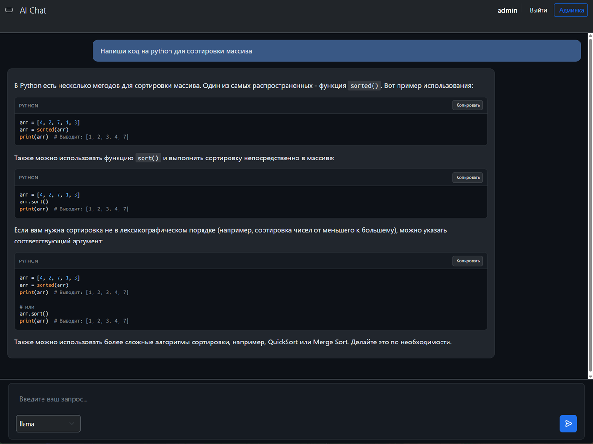
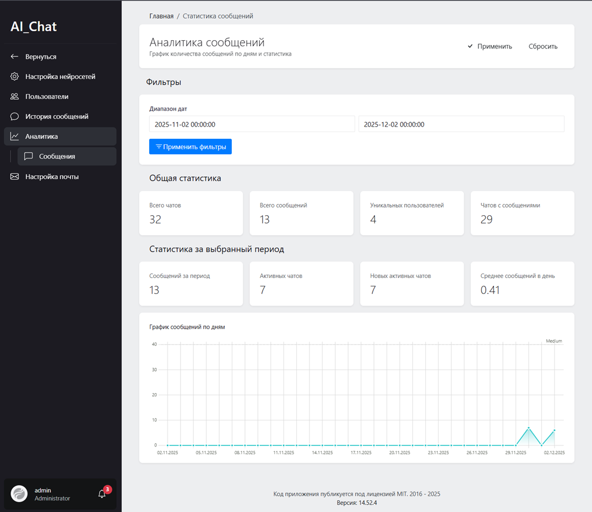

# AiChat — Корпоративный AI-чат на базе Ollama
**AiChat** — это корпоративное решение для безопасного общения с языковыми моделями (LLM). Проект представляет собой полный аналог ChatGPT, развернутый на собственном инфраструктуре с использованием Open-source инструментов.

*Интерфейс пользовательского чата*

*Панель администратора (Orchid)*

## Возможности

- **Чат с LLM**: Поддержка различных моделей через Ollama (Llama, Mistral, Gemma, и др.)
- **Безопасность контента**: Фильтрация запрещенных запросов и уведомления администраторов
- **Гибкая настройка**: Управление системными промптами через админ-панель
- **Аналитика сообщений**: Полный разбор диалогов пользователей
- **Система уведомлений**: Мгновенные алерты при подозрительной активности

## Технологический стек

| Компонент       | Технологии                         |
|-----------------|------------------------------------|
| **Backend**     | Laravel, PHP 8.4                   |
| **Frontend**    | JavaScript (Vanilla), Bootstrap    |
| **Database**    | MySQL 8.0, Redis (кэширование/очереди) |
| **Infrastructure** | Docker, Nginx                      |
| **Admin Panel** | Orchid Platform                    |
| **AI Engine**   | Ollama (локальный запуск моделей)  |
| **WebServer**   | Nginx                              |

